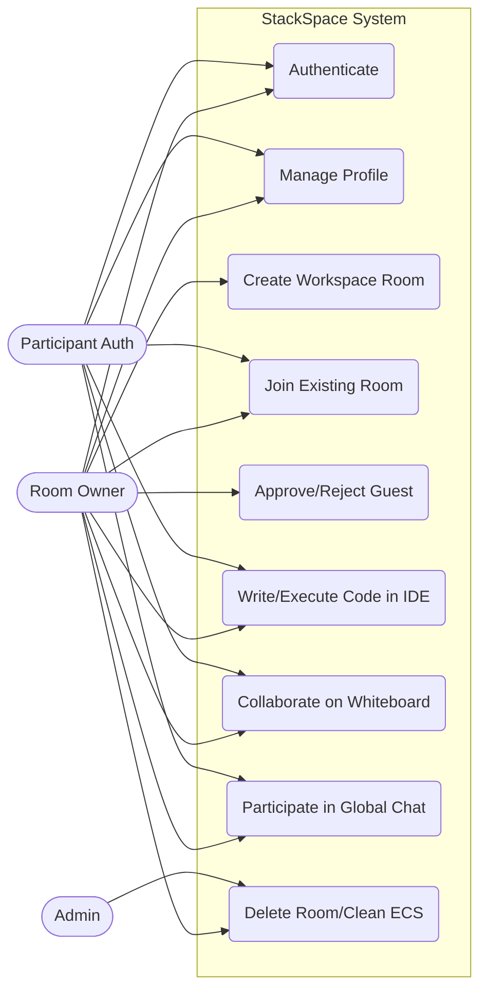
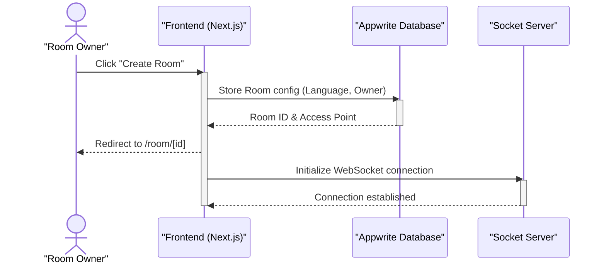
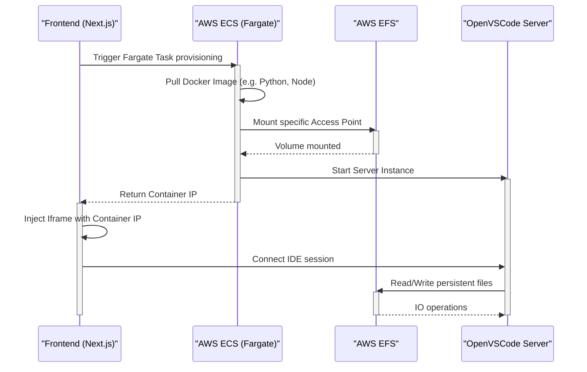
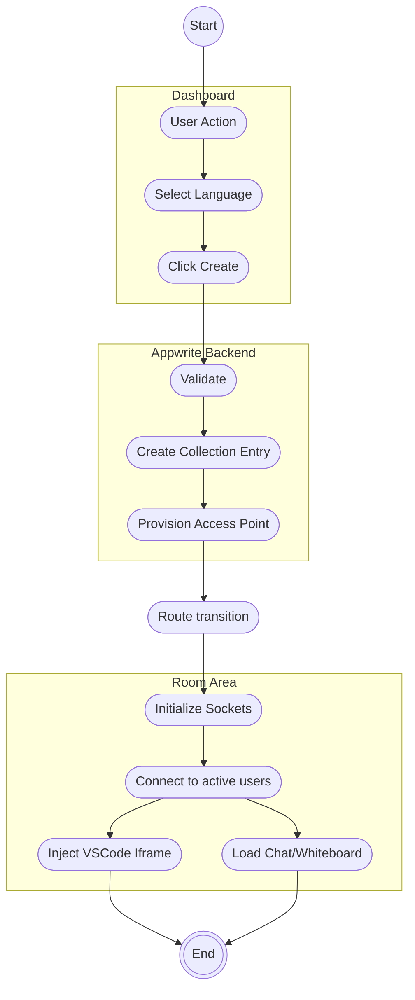
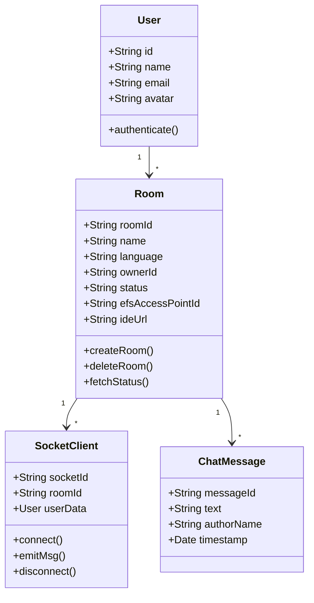
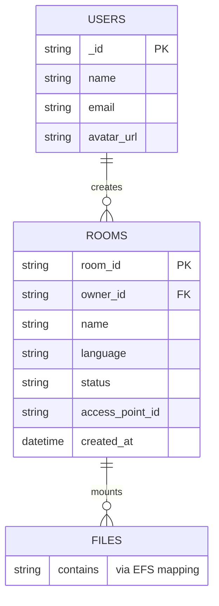
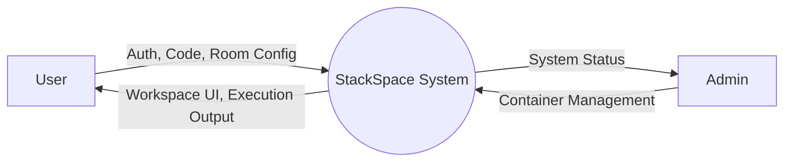
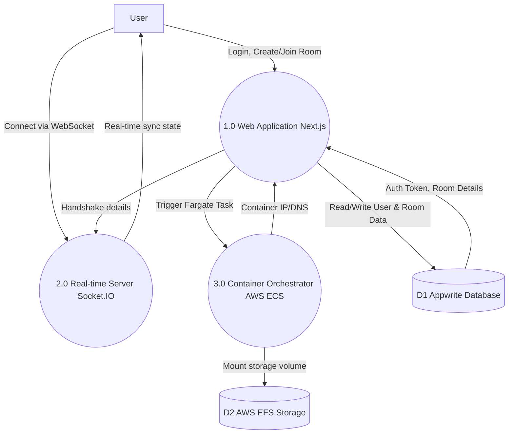
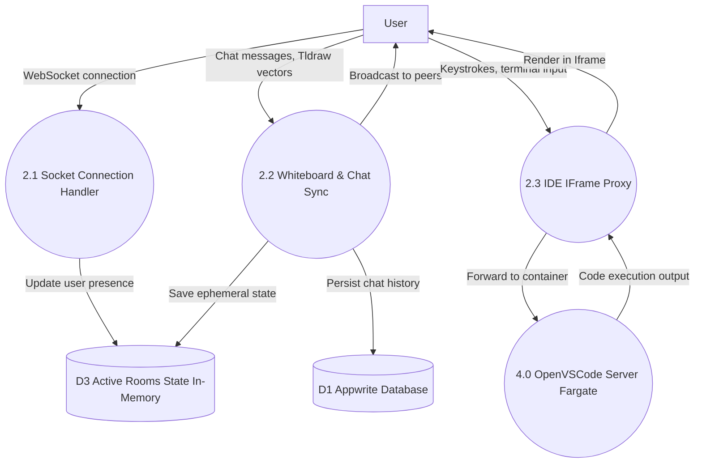

# CHAPTER 3: SYSTEM DESIGN

## 3.1 Design Methodology

System Design is the process of defining the architecture, components, modules, interfaces, and data for a system to satisfy specified requirements. For StackSpace, an architectural synthesis of **Micro-services** and **Event-driven** design patterns was employed. 

Rather than building a brittle monolith, the application was decentralized:
1. **Frontend (Next.js):** Handles purely UI rendering, OAuth execution, and user interactions.
2. **Database & Auth (Appwrite):** Completely independent BaaS layer managing user records and persistent metadata.
3. **Socket Server (Node.js):** An isolated microservice handling real-time WebRTC/WebSocket events.
4. **Compute Engine (AWS ECS):** AWS dynamically spinning up isolated containers.

This decoupled methodology ensures that a heavy computational payload in the IDE, or a spike in concurrent WebSocket connections, does not crash the main web server/dashboard, ensuring high availability.

## 3.2 UML Modeling

Unified Modeling Language (UML) is the industry standard for visualizing, specifying, constructing, and documenting the artifacts of a software-intensive system.

*(Note: The following diagrams are rendered using Mermaid.js)*

### 3.2.1 Use Case Diagram

A Use Case diagram captures the system's core capabilities by representing interactions between users (actors) and the system.




### 3.2.2 Sequence Diagrams

The Sequence Diagrams illustrate the critical flows of the system, detailing how objects interact in sequential order across various modules.

##### 3.2.2.1 Module 1: Authentication

```mermaid
sequenceDiagram
    actor Participant as "Participant (Auth)"
    participant Frontend as "Frontend (Next.js)"
    participant AppwriteDB as "Appwrite Database"
    
    Participant->>Frontend: Login / Register
    activate Frontend
    Frontend->>AppwriteDB: Authenticate credentials
    activate AppwriteDB
    AppwriteDB-->>Frontend: JWT Token & Session
    deactivate AppwriteDB
    Frontend-->>Participant: Redirect to Dashboard
    deactivate Frontend
```

#### 3.2.2.2 Module 2: Room Creation



#### 3.2.2.3 Module 3: Joining (Knock-to-Enter System)

```mermaid
sequenceDiagram
    actor Participant as "Participant (Auth)"
    participant Frontend as "Frontend (Next.js)"
    participant SocketServer as "Socket Server"
    actor Host as "Room Host"
    
    Participant->>Frontend: Navigates to Room URL
    activate Frontend
    Frontend->>SocketServer: Emit "join-request"
    activate SocketServer
    Frontend-->>Participant: Show Animated Waiting Lobby
    SocketServer->>Host: Forward "join-request" (Push Toast)
    deactivate SocketServer
    
    activate Host
    Host->>Host: Clicks "Approve"
    Host->>SocketServer: Emit "join-response" (approved: true)
    deactivate Host
    
    activate SocketServer
    SocketServer->>Frontend: Forward "join-response"
    deactivate SocketServer
    Frontend-->>Participant: Grant Access & Load Workspace
    deactivate Frontend
```

#### 3.2.2.4 Module 4: Container Orchestration & IDE Session




### 3.2.3 Activity Diagram

The Activity diagram illustrates the dynamic nature of the system by modeling the flow of control from activity to activity. Here is the activity flow for **Room Creation and Collaboration**.




### 3.2.4 Class Diagram

The Class Diagram highlights the logical representation of the major data structures and their relationships in the application code.




## 3.3 Database Design

While StackSpace is predominantly a real-time computing application rather than a heavy CRUD application, reliable data models are paramount for state management. Appwrite acts as our NoSQL document store.

### 3.3.1 Entity Relationship Diagram (ERD)




### 3.3.2 Data Flow Diagrams (DFD)

A DFD maps out the flow of information for any process or system. Below are the 3 levels of DFD for the StackSpace Core workflow.

#### 3.3.2.1 Level 0 DFD (Context Diagram)



#### 3.3.2.2 Level 1 DFD (Module Level)



#### 3.3.2.3 Level 2 DFD (IDE & Collaboration Module)




## 3.4 Input Design

Input design dictates how data is entered into the system. For a SaaS platform, validation and security are paramount to prevent injection attacks and bad states.

1. **Room Creation Modal:**
   - **Fields:** Room Name (text output), Language Selection (dropdown enum: nodejs, python, cpp, java, nextjs).
   - **Validation:** Enforced via `Zod` schema validation on the frontend before form submission. React Hook Form is used to manage input states and provide real-time error hints (e.g., "Room name cannot be empty").
   
2. **Chat Input Box:**
   - **Fields:** Message area (textarea), File upload trigger.
   - **Design:** Engineered to handle "Enter" to send, and "Shift+Enter" for multi-line inputs seamlessly to mimic modern chat UX (Discord/Slack).

3. **IDE Code Editor (OpenVSCode Client):**
   - **Fields:** The entire text editor interface.
   - **Mechanism:** Input is captured inside an `iframe`, mapped to virtual keystrokes, and sent to the remote AWS environment directly via Websockets bypassing the Next.js server entirely.

## 3.5 Output Design

Output design determines how processed information is presented back to the user or downstream systems in an intelligible, aesthetic format.

1. **Animated Waiting Lobby / Knock-to-Enter Response:**
   - If a guest is rejected, rather than showing a generic error, the system outputs an animated Framer Motion sequence converting the lobby into an "Access Denied" state with a visual cue to return to the dashboard.
   
2. **Owner Approval Toast (JoinApprovalToast):**
   - The UI outputs a rich, floating component showing the requesting user's avatar, name, and a high-visibility progress bar ticking down 60 seconds before automatically failing the request if ignored.
   
3. **Dashboard Real-time Grids:**
   - The primary user dashboard queries the Appwrite database and outputs a responsive grid of card components. Each card displays conditional UI badges based on the room's AWS status (e.g., Green "Running", Grey "Stopped").

## 3.6 Code Design and Development

The source code directory structure was architected utilizing a "Monorepo" strategy to manage multiple moving parts efficiently:

1. `apps/web`: The central Next.js application containing all React UI components (`src/components`), custom hooks, contextual state (`src/context`), and Serverless API routes (`src/app/api`).
2. `apps/socket-server`: A standalone Node.js Express server housing the Socket.IO setup. It manages the `RoomState` memory objects mapped to Socket IDs safely preventing memory leaks upon user disconnection.
3. `docker/`: Contains specialized `Dockerfile` variants (e.g., `Dockerfile.python`, `Dockerfile.cpp`) and deployment scripts that build and push container images to AWS ECR. 

This strict separation of concerns means visual UI bugs do not bleed into real-time server logic, and infrastructure changes can be committed to the docker folders without halting frontend deployment pipelines.
