# CHAPTER 3: SYSTEM DESIGN

## 3.1 Design Methodology

System Design is the process of defining the architecture, components, modules, interfaces, and data for a system to satisfy specified requirements. For the **Sentinel Work Integrity System**, an architectural synthesis of **Client-Server** and **Micro-services** design patterns was employed. 

Rather than building a brittle monolith, the application was decoupled into three core components:
1. **Frontend Dashboard (React/Vite):** Handles purely UI rendering, administrative controls, data visualization, and reporting.
2. **Backend Services (FastAPI/Python):** Acts as the central orchestrator, exposing RESTful APIs, managing WebSockets, running background automated tasks (e.g., demo resets, email notifications), and housing the MindCompass Abnormality Engine.
3. **Desktop Application (PySide6/Python):** A localized native client that operates on the employee's machine to securely monitor keystrokes, application usage, and system events.
4. **Database & Auth (Supabase/PostgreSQL):** A highly scalable backend-as-a-service (BaaS) handling identity, Role-Based Access Control (RBAC), and relational data persistence.

This decoupled methodology ensures that intensive background tasks like email processing or running diagnostic models do not block the main dashboard execution or interrupt the continuous data ingestion from the desktop clients.

## 3.2 UML Modeling

Unified Modeling Language (UML) is the industry standard for visualizing, specifying, constructing, and documenting the artifacts of a software-intensive system. By establishing a standardized set of visual modeling constructs, UML enables software engineers, system architects, and stakeholders to clearly communicate the structural and behavioral blueprints of complex applications before extensive coding begins. For the Sentinel Work Integrity System, UML acts as a critical bridge between the high-level business requirements of employee monitoring and the intricate, event-driven technical implementations in the backend.

*(Note: The following architectural diagrams are programmatically rendered using Mermaid.js syntax for precise, version-controlled documentation)*

### 3.2.1 Use Case Diagram

A Use Case diagram captures the system's core functional requirements by mapping the dynamic interactions between external entities (known as actors) and the internal boundaries of the system. It abstracts the technical complexity to focus entirely on *what* the system does rather than *how* it does it. 

In the context of the Sentinel ecosystem, the diagram delineates the stark privilege separation between two primary actors: the **Employee** (who interacts passively with the desktop client to record sessions and manually requests leaves/appeals) and the **Administrator** (who commands the dashboard to review detected anomalies, generate comprehensive audit reports, and govern task assignments). The **Sentinel Engine** itself acts as an autonomous background actor, continuously evaluating productivity metrics and triggering abnormality alerts when predefined heuristic thresholds are breached.

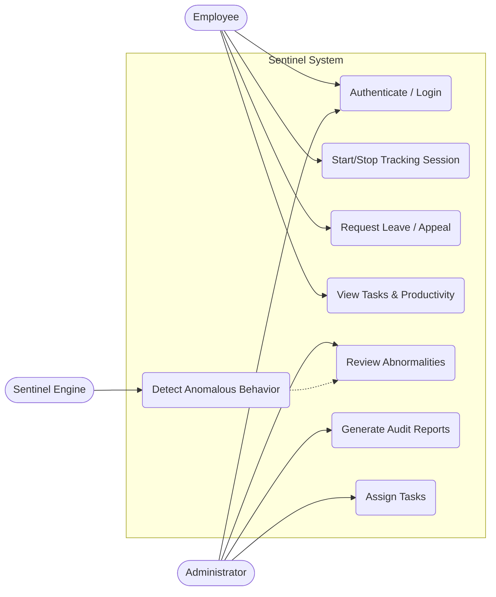

<i>Figure 3.2.1: Use Case Diagram</i>

### 3.2.2 Sequence Diagrams

The Sequence Diagrams illustrate the critical flows of the system, detailing how objects interact in sequential order across various modules.

#### 3.2.2.1 Module 1: Authentication

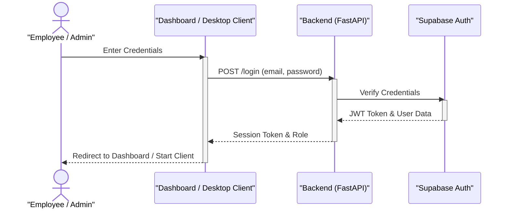

<i>Figure 3.2.2.1: Module 1: Authentication</i>

#### 3.2.2.2 Module 2: Desktop Tracking & Input Collection

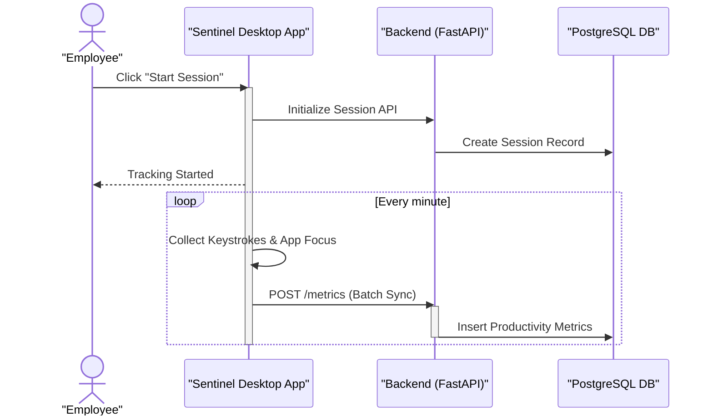

<i>Figure 3.2.2.2: Module 2: Desktop Tracking & Input Collection</i>

#### 3.2.2.3 Module 3: MindCompass Abnormality Detection

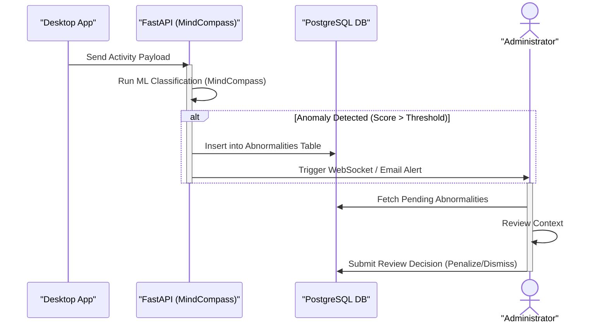

<i>Figure 3.2.2.3: Module 3: MindCompass Abnormality Detection</i>

#### 3.2.2.4 Module 4: Tasks & Appeals

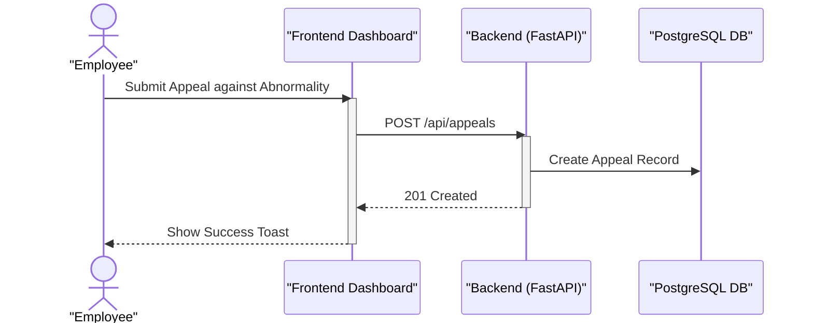

<i>Figure 3.2.2.4: Module 4: Tasks & Appeals</i>

### 3.2.3 Activity Diagram

The Activity diagram illustrates the dynamic nature of the system by modeling the flow of control from activity to activity. Here is the activity flow for **Session Lifecycle & Abnormality Handling**.

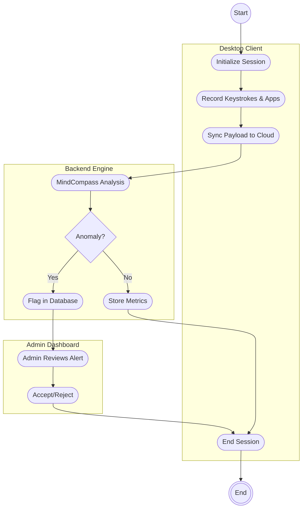

<i>Figure 3.2.3: Activity Diagram</i>

### 3.2.4 Class Diagram

The Class Diagram highlights the logical representation of the major data structures and their relationships in the application code.

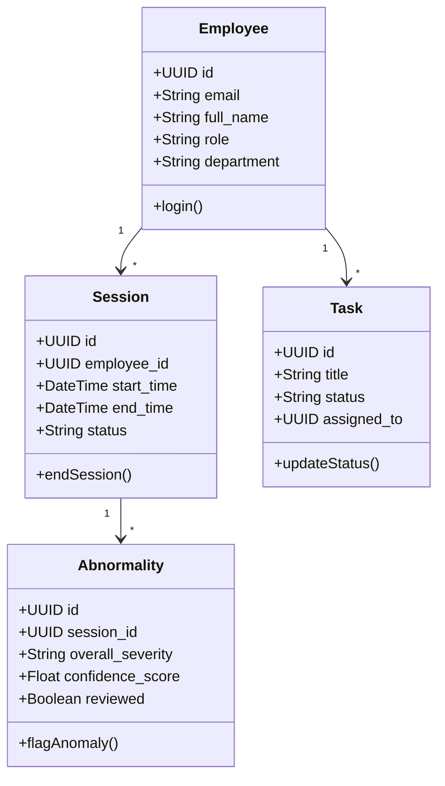

<i>Figure 3.2.4: Class Diagram</i>

## 3.3 Database Design

Sentinel utilizes Supabase (PostgreSQL) to ensure relational integrity, highly structured schemas, and robust querying capabilities suitable for enterprise resource tracking.

### 3.3.1 Entity Relationship Diagrams (ERD)

To ensure the database schema remains readable and fits appropriately on a standard document page, it has been divided into two logical modules.

#### 3.3.1.1 Core Activity & Tracking ERD

This module highlights the core real-time tracking architecture, detailing how employee sessions trigger productivity metrics and abnormality events.

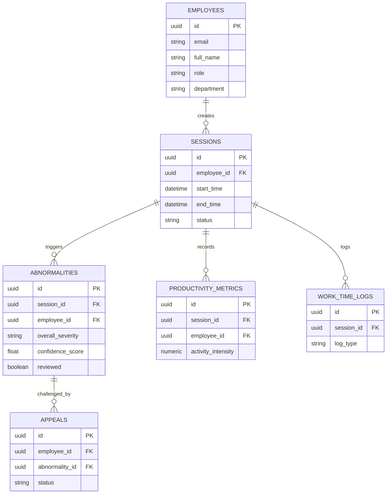

<i>Figure 3.3.1.1: Core Activity & Tracking ERD</i>

#### 3.3.1.2 Administrative & HR ERD

This module maps the organizational entities, detailing how tasks, leaves, and administrative rules map to the workforce.

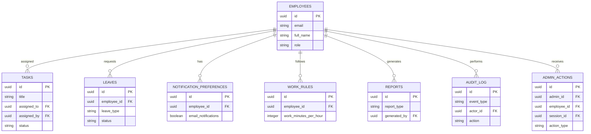

<i>Figure 3.3.1.2: Administrative & HR ERD</i>

### 3.3.2 Data Flow Diagrams (DFD)

A DFD maps out the flow of information for any process or system. Below are the 3 levels of DFD for the Sentinel Core workflow.

#### 3.3.2.1 Level 0 DFD (Context Diagram)

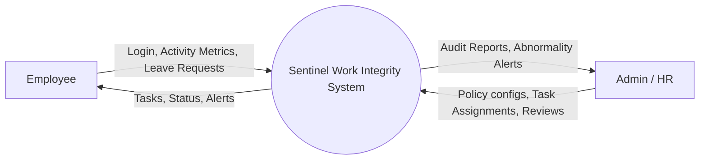

<i>Figure 3.3.2.1: Level 0 DFD (Context Diagram)</i>

#### 3.3.2.2 Level 1 DFD (Module Level)

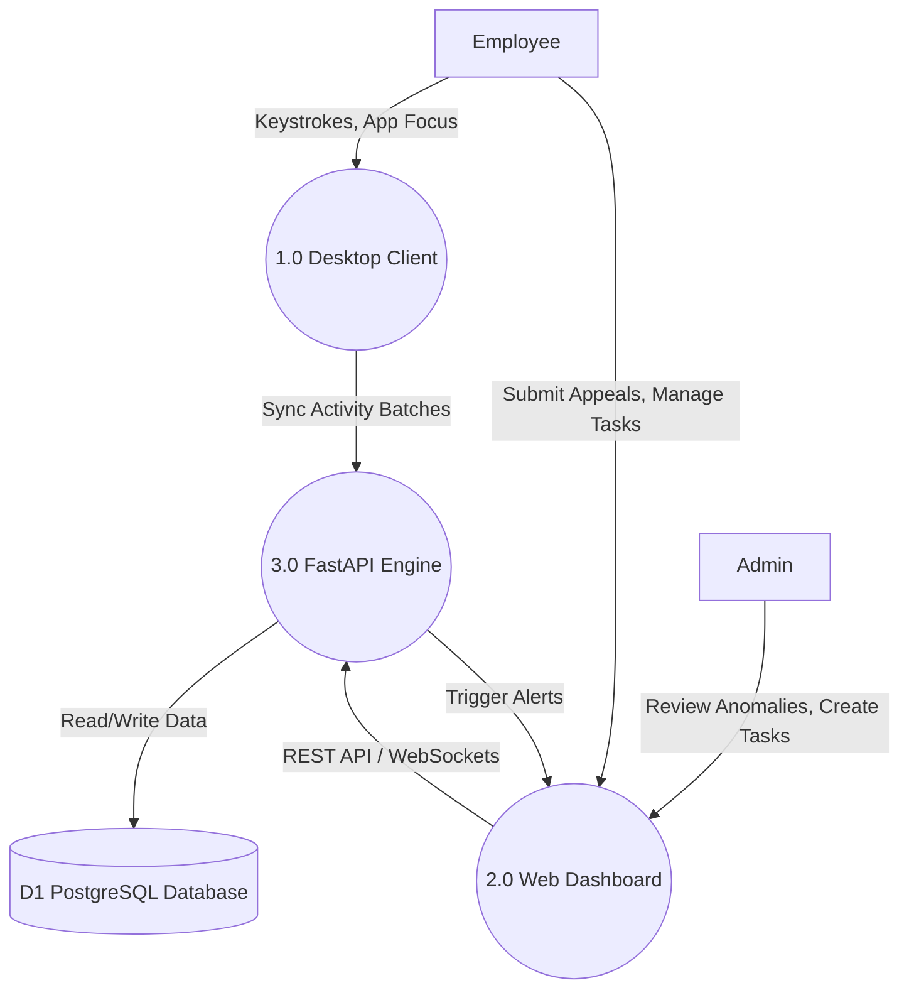

<i>Figure 3.3.2.2: Level 1 DFD (Module Level)</i>

#### 3.3.2.3 Level 2 DFD (MindCompass & Activity Module)

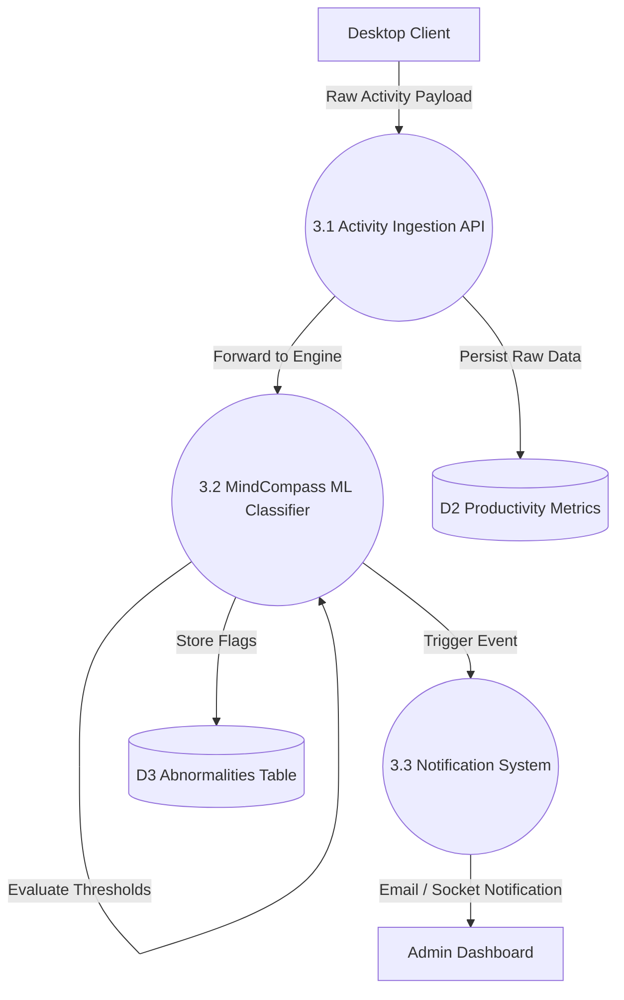

<i>Figure 3.3.2.3: Level 2 DFD (MindCompass & Activity Module)</i>

## 3.4 Input Design

Input design dictates how data is entered into the system. For an enterprise integrity platform, validation, security, and silent ingestion are paramount.

1. **Desktop Activity Tracking (Automated Input):**
   - **Mechanism:** The PySide6 client silently hooks into the OS to capture active window titles, keystroke intensity, and mouse movement deltas.
   - **Validation:** Inputs are locally aggregated, structured into JSON batches, and transmitted securely over HTTPS to avoid network payload overload.
   
2. **Dashboard Forms (Manual Input):**
   - **Fields:** Leave Requests, Task Creation, and Appeals forms.
   - **Validation:** Managed via strict React state hooks on the frontend, combined with FastAPI Pydantic schemas on the backend which enforce field lengths, type safety, and valid enumerations (e.g., Status must be `pending`, `approved`, or `rejected`).

## 3.5 Output Design

Output design determines how processed information is presented back to the user or downstream systems in an intelligible, aesthetic format.

1. **Administrator Dashboard Grids & Charts:**
   - The primary UI outputs statistical aggregations of employee productivity. Data is visualized via charts mapping focus hours and break intervals. Real-time anomalous events appear at the top of the feed with high-visibility red markers.
   
2. **Automated Email Notifications:**
   - Sentinel utilizes `smtplib` and MIME formatting to dispatch beautifully branded HTML emails for critical events, such as when a leave request is approved by an administrator or an appeal is updated.
   
3. **Desktop Toasts (Employee UI):**
   - The desktop client provides localized, non-intrusive systemic feedback via system tray notifications (e.g., "Session Started", "Take a Break").

## 3.6 Code Design and Development

The source code directory structure was architected utilizing a "Monorepo" strategy to manage multiple distinct operational domains efficiently:

1. `backend/`: A FastAPI Python server holding API endpoints (`app/api/`), the MindCompass diagnostic models (`app/services/`), Pydantic schemas, and background tasks (like `demo_reset.py` and `email_tasks.py`).
2. `dashboard/`: A React Single-Page Application (SPA) handling the comprehensive web interface, contextual state, routing, and WebSocket listeners.
3. `desktop-app/`: A self-contained PySide6 Python application equipped with PyInstaller configurations (`sentinel.spec`) to build executable binaries for end-users, housing the native OS monitoring modules (`src/detection/`).

This strict separation of concerns means algorithmic updates to the detection engine on the backend do not require rebuilding the desktop binaries, and dashboard visual redesigns do not risk halting background API operations.
