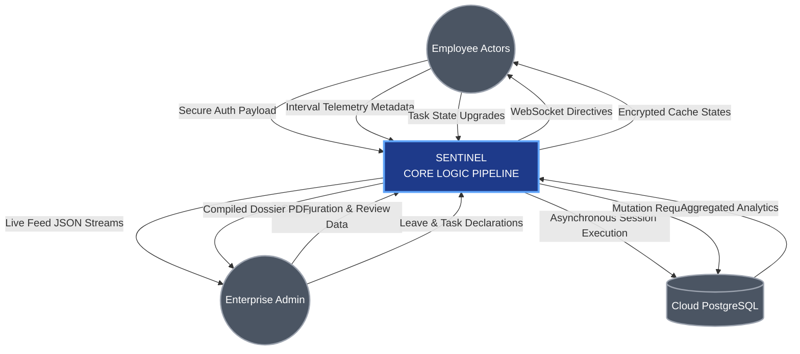
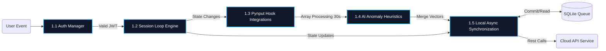
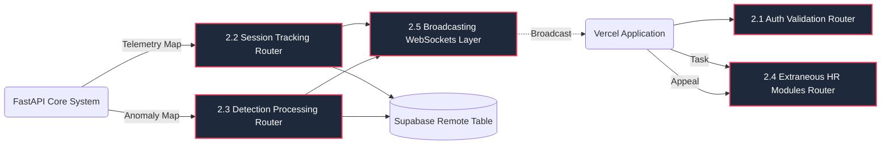

# CHAPTER 3 — SYSTEM ANALYSIS

## 3.1 Feasibility Study

A thorough preliminary feasibility study was conducted prior to engaging the formal development lifecycle for SENTINEL. Evaluating project boundaries through the dimensions of technical, economic, and operational capabilities ensures that the system logic could traverse the boundaries of concept formulation to actualized production environments. 

### 3.1.1 Technical Feasibility
The technical requirements of SENTINEL initially presented significant difficulty centering around cross-boundary application synchronization. The system required absolute mastery over Python's ecosystem: utilizing advanced libraries like `pynput` for attaching global, low-level keyboard/mouse hooking loops alongside `win32clipboard` for querying exact active memory integer states from the Windows OS environment. Presenting complex native desktop User Interfaces directly through script logic necessitated moving past fundamental standard libraries toward modern wrappers; `customtkinter` supplied modern, dynamically themed Tkinter overlays. For the remote cloud layer, the adoption of FastAPI effectively guaranteed deep integration with modern `async/await` features mandatory for managing live bidirectional WebSocket traffic maps, while SQLAlchemy async dialects facilitated flawless database ORM mapping interactions. On the presentation face, React's component-based component model integrated rapidly alongside Vite's optimized build tooling, creating a highly performant admin interface. Technical feasibility was thoroughly confirmed as all selected technologies possessed mature, heavily documented libraries supported rigorously by active global maintenance communities.

### 3.1.2 Economic Feasibility
The comprehensive development architecture behind SENTINEL was deliberately engineered to maintain a cost-profile at absolute statistical zero during initial prototyping and early production distribution arrays. The entire foundational technology stack relies on unrestrictive open-source software licenses. Hardware dependencies required nothing beyond a general-purpose processor unit running a standard Windows environment for the author. Regarding deployment infrastructure pipelines, modern global CDN and compute cloud platforms provide extraordinary sandbox tiers. Vercel flawlessly accommodated the SPA React administrative endpoints. Render's robust Linux containers completely handled FastAPI hosting mechanisms, and Supabase's managed Postgres wrapper delivered high-availability tables processing thousands of transactions entirely inside their developer allowance bandwidths.

### 3.1.3 Operational Feasibility
End-user constraints directly mandated an application that possessed zero active friction footprints for enterprise employees lacking granular technical training. To solve this prerequisite, the Python desktop application was encapsulated directly into a monolithic, unified `.exe` binary package via PyInstaller compilation. This allowed direct corporate distribution where an employee can trigger tracking functionality essentially identically to opening a web browser: bypassing the necessity of installing complex core languages or terminal dependencies on remote machines. From the administrator overview trajectory, leveraging a modernized web dashboard implementing dark-themed Tailwind patterns directly matches formatting logic inherent across pre-existing, familiar SaaS CRM tools they are already conditioned to manage. Thus, operationally, the friction curve is essentially nonexistent. 

## 3.2 Requirements Analysis

Requirement generation resulted from synthesizing broad operational gaps noticed across enterprise workflow behaviors during widespread global digital transitions mapping traditional office hours to fragmented residential timelines. Understanding these conditions generated granular boundaries dictating expected behavior models for the final application states.

## 3.3 Functional Requirements

Functional Requirements mathematically denote the exact physical or logical tasks an application mechanism must flawlessly execute to fulfill the core operational parameters of the project deployment.

| FR ID | Module Sector | Concrete Requirement Specifier | Priority Target |
|:---|:---|:---|:---|
| **FR-01** | Authentication | The system must secure user entry endpoints via email/password logic, exchanging valid credentials for secure JSON Web Tokens containing nested role boundaries. | Critical |
| **FR-02** | Session Initialization | Employees must manually invoke local application Start, Pause (Break/Lunch) triggers dictating OS-level state transitions communicating with the master record API. | Critical |
| **FR-03** | Conflict Resolution | Backend services must reject dual-concurrent active session requests generated mapped across multiple distinct physical machines tracking identical IDs simultaneously. | High |
| **FR-04** | Metadata Engine | The desktop agent must execute continuous interception of keystroke variables tracking *only* temporal mathematical gaps generated organically traversing physical switch inputs. | Critical |
| **FR-05** | Hardware Simulation Tracking | The application must map OS cursor vectors recursively determining algorithmic intervals exposing continuous artificial geometric paths representing physical Mouse Jigglers. | High |
| **FR-06** | Clipboard Dump Detection | Integrating deep OS clipboard API commands, the framework must track literal integer lengths of character-arrays triggering paste outputs during active timers. | Medium |
| **FR-07** | Local Cache Queue | The primary application loop must automatically push telemetry packages attempting connection validation, while redirecting failing REST packets into recursive SQLite queues resolving offline continuity. | High |
| **FR-08** | Event Driven WebSockets | Administrator panels actively tracking network routes must possess live-mutating component graphs immediately displaying any trigger flags initiated globally. | High |
| **FR-09** | Management Workflows | Standardized REST layers must provide managers dynamic PUT requests capable of overriding specific workflow states managing system-generated alert warnings or physical appeals. | Medium|
| **FR-10** | Leave Cycle Processing | Full organizational hierarchies allowing application deployment matching standard date parameters updating global status trackers directly generating external SMTP updates. | Low | 

## 3.4 Non-Functional Requirements

Non-functional requirements dictate exactly *how well* or within what conditional parameters the defined functionality must execute. They evaluate global system dynamics including architectural security boundaries, scaling response horizons, and fundamental performance degradation curves.

| NFR ID | Category Class | Definition Statement | Metric Benchmark Validation |
|:---|:---|:---|:---|
| **NFR-01** | Execution Speed | Cloud REST interactions must maintain immediate execution trajectories bypassing cold-start issues when handling standard queries. | Response < 400ms (P95) |
| **NFR-02** | Algorithmic Pacing | Deep recursive detection arrays tracking complex intervals must reset calculation models aggressively reducing localized CPU burden graphs. | 30-Second Cadence |
| **NFR-03** | Core Security | Endpoint routing procedures executing data mutation must dynamically unpack encrypted bearer headers enforcing explicit boundary checks mapping user authorization. | 100% Endpoint Coverage |
| **NFR-04** | Pure Privacy Laws | Logic processing HCI interactions on local layers must mathematically obfuscate, ignore, or instantly discard physical keystroke payload arrays protecting extreme confidentialities. | 0 Data-In-Rest Characters |
| **NFR-05** | Distributed Scaling | ASGI backend servers alongside decoupled connection arrays must support sustained high-traffic mapping intervals globally transmitting simultaneous payload requests. | > 100 Active WebSocket Users|
| **NFR-06** | Distribution Modularity| Executable distribution requires encapsulated configurations shielding employees from generating local developer dependencies executing tracking applications. | Single `.exe` Compile Formats |
| **NFR-07** | Network Resilience | Connection anomalies dropping physical external interfaces must be bypassed smoothly using local logical queue formations pushing cached data states actively once routers successfully return. | SQLite Integrity Tracking |

## 3.5 Use Case Diagrams

Use case topologies structurally decompose precisely how defined 'Actor' personas traverse specific functional interaction environments navigating the conceptual software boundaries.

### 3.5.1 Admin Operational Use Case Framework

```mermaid
usecaseDiagram
    actor "HR Administrator" as Admin
    
    package "SENTINEL Administrative Dashboard" {
        usecase "Authenticate Profile JWT" as UCA1
        usecase "Monitor Global WebSocket Stream" as UCA2
        usecase "Review Flagged Work Sessions" as UCA3
        usecase "Approve/Reject Leave Tiers" as UCA4
        usecase "Dispatch Assignment Tasks" as UCA5
        usecase "Export Personnel Audit PDF" as UCA6
    }
    
    Admin --> UCA1
    Admin --> UCA2
    Admin --> UCA3
    Admin --> UCA4
    Admin --> UCA5
    Admin --> UCA6
    
    UCA3 ..> UCA2 : <<includes>> alert updates
```

### 3.5.2 Employee Interactive Use Case Framework

```mermaid
usecaseDiagram
    actor "Enterprise Employee" as Employee
    
    package "SENTINEL Desktop & SPA Ecosystem" {
        usecase "Initialize Offline/Online Boot" as UCE1
        usecase "Transition Session Flow States" as UCE2
        usecase "Generate Native Metadata Telemetry" as UCE3
        usecase "Submit Personal Appeal Notice" as UCE4
        usecase "Track Task Completion Vectors" as UCE5
        usecase "Execute Scheduled Workflow Ends" as UCE6
    }
    
    Employee --> UCE1
    Employee --> UCE2
    Employee --> UCE4
    Employee --> UCE5
    Employee --> UCE6
    
    UCE2 ..> UCE3 : <<triggers>> background loops
```

## 3.6 Data Flow Diagrams

Data Flow charting sequentially illustrates the exact physical and conceptual routing trajectories generated input queries undertake as they transit across decoupled software domains inside the SENTINEL overarching macro-environment.

### 3.6.1 Level 0 Context Structure



### 3.6.2 Level 1 Decomposition: Desktop Architecture 



### 3.6.3 Level 1 Decomposition: Web Application Services


