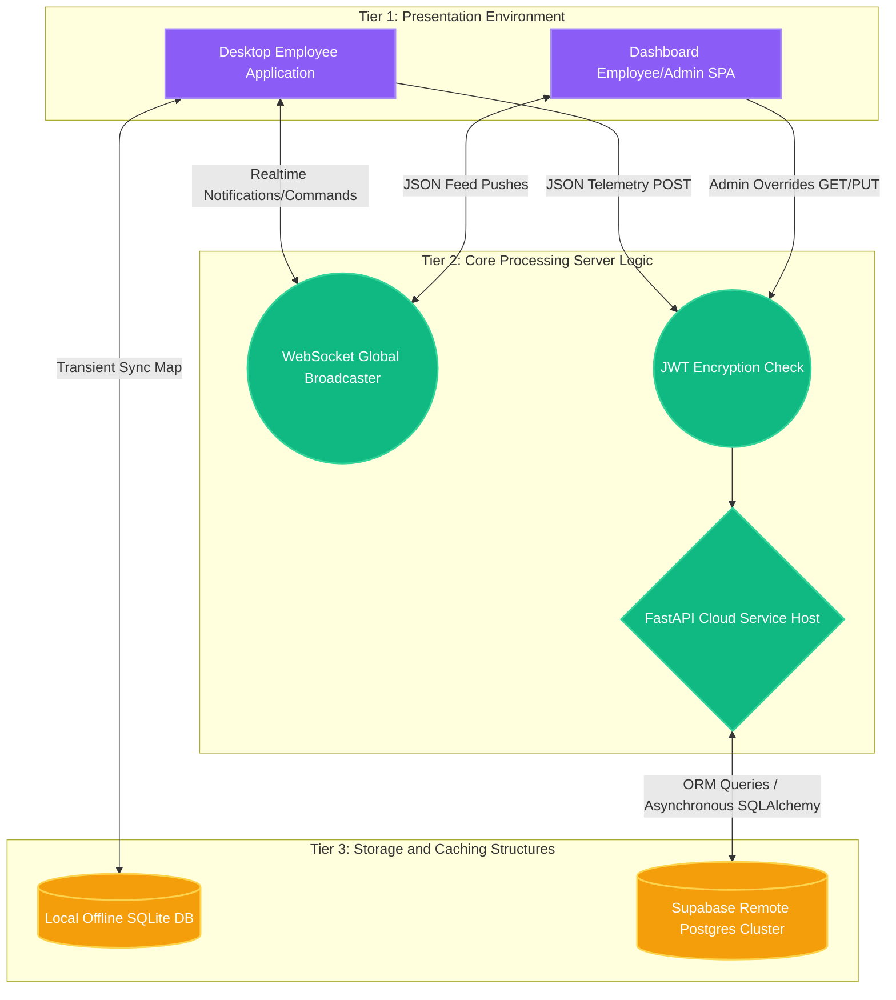
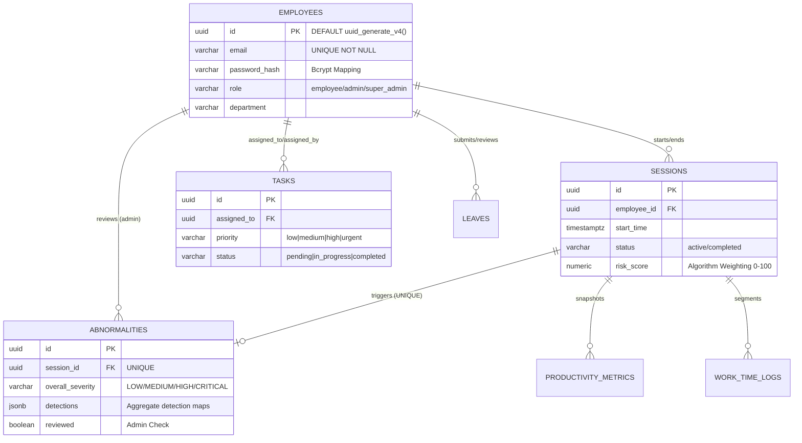

# CHAPTER 4 — SYSTEM DESIGN

## 4.1 System Architecture Topology

The software topology supporting SENTINEL embodies a classic unified "Three-Tier Client-Server Architecture," significantly augmented with asynchronous bidirectional websocket streams ensuring ultra-low latency operational visibility. This separation inherently compartmentalizes strict presentation overlays from core business computational rules and external relational storage structures, massively improving unit modularity and scaling redundancy. 

### 4.1.1 Architectural Hierarchy

1. **Tier 1 — The Presentation / Client Layer**
   - The primary employee-facing input portal consists of a compiled Python standalone graphical executable utilizing `CustomTkinter`. It handles session inputs, offline SQLite synchronization status reporting, and instantaneous OS notification alerts regarding flagged anomaly algorithms.
   - The administrative portal runs entirely via a Single Page Application (SPA) utilizing `React.js` and `TailwindCSS` hosted on edge-delivery networks. This layer processes complex human interactions including assigning tasks, modifying leaves, reviewing employee telemetry logs, and monitoring real-time graphs.

2. **Tier 2 — Application / Logic Server Layer**
   - Operating permanently inside scalable cloud containers on Render, the backend relies fundamentally on the asynchronous Python framework `FastAPI`. This layer enforces authorization routing bounds, algorithmically dictates complex data merging sequences into nested `JSONB` structures, governs HTTP status error generations, manages file exporting mechanisms via `ReportLab`, and hosts the WebSocket routing core binding administrative browsers to employee desktops.

3. **Tier 3 — Persistent Data Layer**
   - The primary persistence store utilizes PostgresSQL mapped explicitly using `Supabase` which grants instantaneous access to 12 heavily normalized 3NF relational grids. Localized edge clients maintain transient offline data configurations utilizing a lightweight file-driven database mapping (`SQLite`), preventing local data wipeouts from networking latency or global cloud outages. 

## 4.2 Database Design 

The PostgreSQL instance mapped into `Supabase` utilizes a precisely designed relational schema. Strict normalization parameters prevent redundant overlap while maximizing specific telemetry lookups. The most sophisticated innovation lies inside the `abnormalities` structure where continuous AI telemetry detections mapped tightly per individual session aggregate directly inside a flexible scaling `JSONB` constraint column, dramatically lowering structural row overloads.

**Entity-Relationship (ER) Blueprint Diagram:**

## 4.3 Detection Engine Mathematical Weighting Algorithms

To produce the overarching session mapping `risk_score` generated inside the anomaly engine routines, individual events flagged during interval scanning dynamically inject priority weights ranging mathematically between absolute fractions representing explicit organizational confidence limits.

| Detection AI Vector | Internal Priority Class | Behavioral Evaluation Mechanism | Algorithmic Confidence Threshold | Global System Risk Weight |
|:---|:---|:---|:---|:---|
| `mechanical_typing` | **Priority 1** | Keystroke interval variance analysis (`CoV` < 0.15) | > 0.70 | `1.00` |
| `mouse_jiggler` | **Priority 1** | XY plane Cartesian Std Dev consistency intervals | > 0.70 | `1.00` |
| `superhuman_speed` | **Priority 1** | Rolling Words Per Minute boundaries exceeding > 150 WPM continuously | > 0.70 | `0.95` |
| `suspicious_paste` | **Priority 2** | Clipboard integer size tracking (pasting > 1000 characters) frequently | > 0.70 | `0.90` |
| `clock_in_clock_out` | **Priority 2** | Extensive immediate idle duration percentages following successful login events | > 0.70 | `1.00` |
| `rapid_paste` | **Priority 3**  | Detecting 3+ explicit paste array memory triggers inside contiguous 10s cycles | > 0.70 | `0.75` |
| `idle_burst_loop` | **Priority 3** | Recurrent periodic spikes alternating with zero-event pauses perfectly | > 0.70 | `0.85` |

The conclusive `Risk Score` is evaluated at the physical end bounds of a session lifecycle applying logical multipliers if overlapping priority detections invoke concurrently (e.g., A mouse jiggler operating simultaneously with a keyboard macro loop explicitly scales the risk assessment curve sharply to immediately register `CRITICAL` mapping classifications).

## 4.4 API Interface Implementation Blueprint

Developing completely decoupled frontend architectures from backend functionality requires an aggressively strict declarative REST footprint mapping. SENTINEL integrates roughly 14 explicit routing paths completely enforcing JWT token protection chains relying heavily directly upon HTTP definitions.

| Blueprint Core Tag | HTTP Mechanism | Endpoint | General Functional Purpose |
|:---|:---|:---|:---|
| **Authentication** | `POST` / `GET` | `/api/v1/auth/{...}` | Execute token generation, login destruction, encryption refreshing, parameter checks. |
| **Employees** | `GET` / `POST` / `PUT` | `/api/v1/employees/{...}` | Extracting user data, modifying role limits, initiating profile metadata manipulation. |
| **Sessions** | `POST` / `PUT` / `GET` | `/api/v1/sessions/{...}` | Constructing live timer starts, closing off final boundaries, extracting local arrays. |
| **Abnormalities** | `POST` / `GET` | `/api/v1/abnormalities/{...}` | Merging massive physical `JSONB` array payloads seamlessly inside current session graphs. |
| **Leaves** | `POST` / `PATCH` / `GET`| `/api/v1/leaves/{...}` | Reviewing, requesting, modifying organizational vacation and break calendars directly. |
| **Tasks**| `POST` / `PATCH` | `/api/v1/tasks/{...}` | Distributing external mandates immediately utilizing standard assignment rules. |

## 4.5 User Interface (UX/UI) Strategy

Building tools meant exclusively targeting dual-view audiences parameters implies distinct visual language design systems.

- **The Admin/Employee Web View (React Dashboard):** Engineered employing custom `TailwindCSS` directives building off extensive midnight/slate hierarchical color themes (`#0f172a` base backgrounds coupled with `#f8fafc` text layers). It emphasizes severe data legibility focusing specifically on rendering live grids efficiently. The WebSocket "Live Feed Component" organically scales alert popups seamlessly pushing internal data arrays mimicking social networking layout ease.

- **The Desktop End View (OS Executable):** Engineered specifically bypassing traditional OS windows in favor of custom-rendered GUI shapes leveraging `customtkinter` libraries directly over operating systems kernels. The core view represents an organic circular temporal progression bar mapping specific colored geometries corresponding completely directly toward exact behavioral models ('Green' mapping for active working, 'Amber' indicating a pause/break, 'Red' signifying total application exit/idle threshold breakage). Operating system alert toasts invoke asynchronously bypassing entirely minimizing the entire structural layout.
