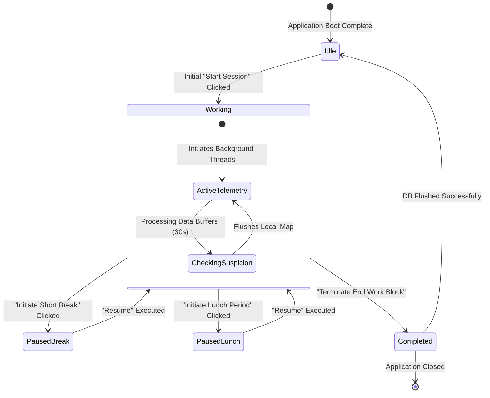

# CHAPTER 5 — IMPLEMENTATION

## 5.1 Technology Stack Rationalization

Executing the complex system designs dictating SENTINEL required selecting incredibly robust, performant frameworks capable of harmonizing real-time interactions with advanced heuristics algorithms effectively. 

### 5.1.1 Programming Architecture Languages
- **Python (3.11):** Chosen as the absolute cornerstone logic language powering both the backend API services and the complete physical desktop application execution. Its profound mathematical analysis libraries and OS-integration mapping modules natively outpace standard JavaScript/C++ alternatives for building rapid data-mining heuristics loops organically.
- **JavaScript (ES6/React 18):** Selected for governing the front-end SPA dashboard due entirely to its massive component ecosystem, lightning-fast DOM rendering diff calculations imperative for managing hundreds of live WebSocket feed alterations concurrently, and overall development velocities.

### 5.1.2 Deployment Stack and External Dependencies
Combining multiple logic engines inherently required advanced dependency integrations mapping the total ecosystem environment perfectly.

| Software Layer | Target Technology | Explicit System Application Purpose |
|:---|:---|:---|
| **OS Desktop Interface** | `customtkinter` | Transposing native Tkinter capabilities converting simple UI blocks toward complex, anti-aliased dark-themed overlay shapes masking Windows desktop elements. |
| **Telemetry Injection** | `pynput` | Providing continuous system-level callback triggers generating temporal gaps identifying organic keystroke and mouse inputs devoid of actual key payload content. |
| **Executable Compiler** | `PyInstaller` | Bundling complete physical Python interpretational arrays masking deployment limits so endpoint employees bypass all local script installations running immediately exactly identical to standardized software. |
| **API Core System** | `FastAPI` + `Uvicorn`| Providing instantaneous local threaded async mapping generating RESTful payload schemas protected dynamically leveraging JWT token security structures processing 10k connections. |
| **Object-Relational Map**| `SQLAlchemy` | Writing direct Pythonic DB abstraction matrices protecting applications inherently bypassing classical SQL-injection attacks processing large session data grids globally. |
| **Cloud PostgreSQL DB** | `Supabase` | Delivering zero-latency hosted postgresSQL table endpoints wrapped dynamically providing global analytics scale bandwidth perfectly integrating asynchronous Python mapping. |
| **React View Layer** | `Vite` + `TailwindCSS`| Bypassing classical Webpack bloat processing hot-module replacements globally ensuring React modules compiled precisely rendering the `Zustand` global states seamlessly. |

## 5.2 Desktop Subsystem Implementation Details

The core functionality of the physical desktop application loops exclusively around three fundamental orchestrators handling states perpetually without creating system-memory leakage traps common to desktop tracking tools.

### 5.2.1 Application Entry Loop and State Handling
Executing the `.exe` dynamically triggers the `SentinelApp` core class. Immediately on application launch, a localized `JWTHandler` parses local user AppData files attempting dynamic silent authentication preventing daily login friction. Following secure token negotiation, the application establishes its system tray wrapper (using `pystray`), initializing background `SyncClient` threaded workers pushing localized data queues automatically at configurable interval checkpoints (default 60s windows).

### 5.2.2 Pynput Input Interception Configuration
The tracking pipeline specifically overrides capturing human keystrokes completely bypassing generic OS behavior. Utilizing the library `pynput.keyboard.Listener`, an infinite global `on_press` asynchronous hook tracks purely event timestamps.
```python
def on_press(self, key):
    current_time = time.time()
    if self.last_key_time is not None:
        interval_ms = (current_time - self.last_key_time) * 1000
        # Mathematical intervals stored. The 'key' variable itself is immediately discarded completely.
        self.keystroke_intervals.append(interval_ms) 
    self.last_key_time = current_time
```

### 5.2.3 Session Lifecycle State Machine Concept

To manage work periods perfectly ensuring telemetry only executes while physical users validate session timelines, a TimeEngine manages strict internal enumerator transition states smoothly tracking data inputs explicitly avoiding overlap.



## 5.3 Backend Service Logic & Asynchrony

Transposing large anomaly arrays rapidly necessitated bypassing fundamentally synchronous Python environments generating massive thread blocking sequences crippling production operations. 

### 5.3.1 Asynchronous Websocket Global Routing
To orchestrate immediate administrative feedback updates, the Python server initializes a custom `ConnectionManager` class. It manages a master dictionary assigning authenticated JWT users literal WebSockets maps targeting direct messaging. A specific `admin-feed` keyword binds all authenticated manager tabs simultaneously allowing targeted massive `broadcast()` sweeps ensuring global synchronization avoiding server DB lookups sequentially saving extreme bandwidth properties dynamically maintaining network stability overall perfectly.

### 5.3.2 Abnormality Database UPSERT Overloads
A core implementation hurdle required storing massive fluctuating algorithm trigger numbers logically avoiding creating literally tens of thousands of database columns corresponding identically per user daily workflows generating physical chaos. 
The system leverages PostgreSQL's intrinsic `JSONB` array formats executing dynamic `INSERT ... ON CONFLICT UPDATE` logic mapping directly over `SQLAlchemy`.
This allows one single row inside the system per specific global employee session identifier mapping directly appending multiple complex string vectors mapping various triggered anomalies exclusively keeping tables absolutely minimalistic providing hyper-efficient scaling trajectories.

## 5.4 React SPA Integration & State Management

The administrative interface heavily implements logical components designed minimizing user traversal loads visually representing physical data explicitly maximizing comprehension. 

### 5.4.1 React Component Hierarchy & WebSockets Implementation
Using standard React hooks `useEffect` integrated tightly managing `WebSocket.io` component rendering hierarchies perfectly ensures the physical UI exclusively updates physical elements mapping exactly triggered database modifications dynamically rendering dynamic notification arrays pushing components down the visual feed loop flawlessly processing identical visual layouts globally generating frictionless review sessions significantly increasing tracking visibility.

## 5.5 CI/CD Deployment Mechanics

Pushing the codebase completely bypassing traditional manual FTP uploads drastically standardized operations. The Git structure strictly splits `desktop-app`, `backend`, and `dashboard` folder layers.
- **Frontend Vercel Pipe:** Executing GitHub push protocols instantly invokes global CDN Edge workers automatically recompiling explicit `.jsx` trees executing standard Vite production builders mapping identical dynamic live websites directly pushing updates literally across all internal enterprise employees observing.
- **Backend Render Integration:** Generating pure Python runtime Linux instances pulling environmental credentials securely initializing web deployments executing Uvicorn hooks simultaneously guaranteeing no operational downtime globally executing logic directly interacting instantaneously via identical data architectures globally ensuring scale processing effectively universally continuously.
